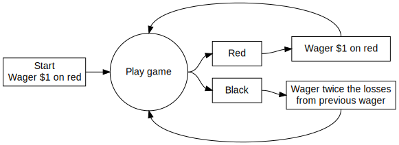
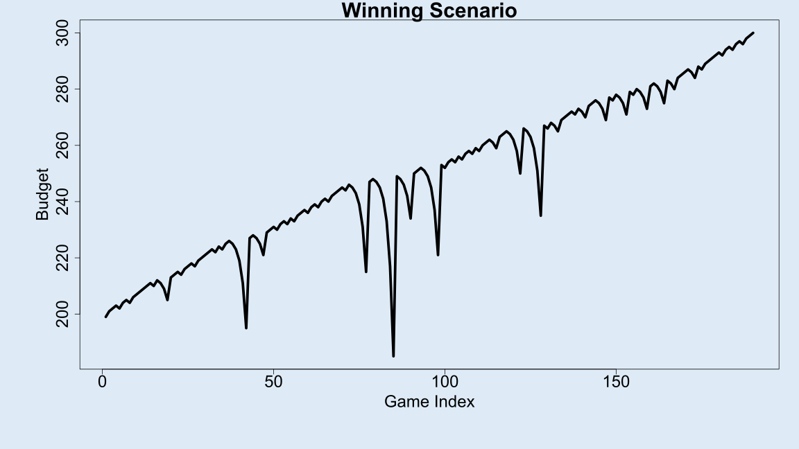
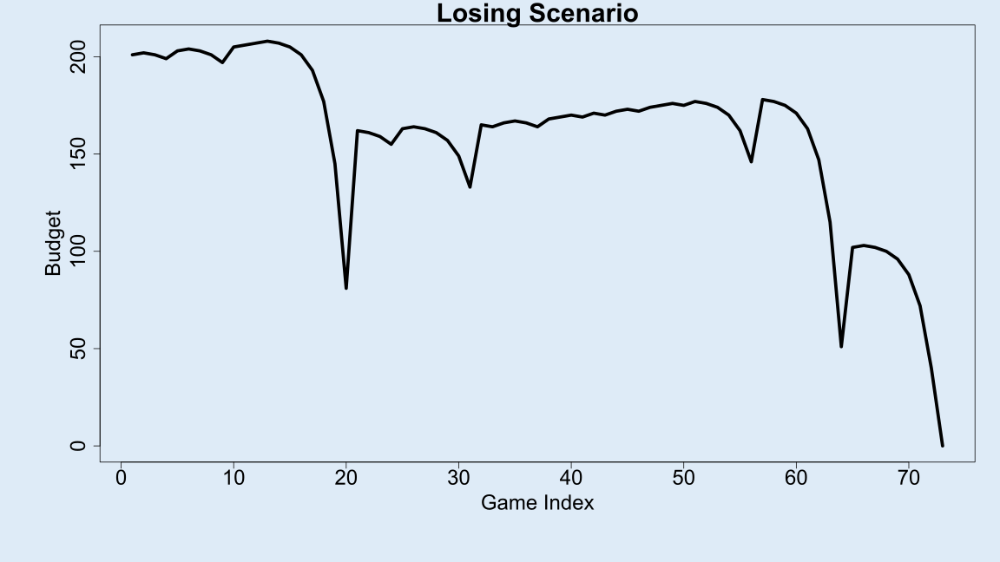

## The Martingale Strategy in Roulette

### Overview
The Martingale strategy is a common strategy used in betting to try and guarantee a profit. In this strategy, the bettor simply doubles their bet after every loss, which theoretically will always result in the bettor recouping their losses and netting a small profit. In the game of roulette, the Martingale strategy can be demonstrated by a bettor putting $1 on red. If the bet loses, you wager twice the amount you lost on red. If the bet wins, you keep your $1 and place another $1 bet on red and repeat. This can be seen in the graphic below:

### Operating Characteristics
There are several operating characteristics that contribute to the possible outcomes of the Martingale strategy in roulette. The main factors that need to be considered are the following:
* ***Stopping rule***
  * The player will stop betting once he/she has ***W*** dollars
  * The player will stop betting once he/she is bankrupt
  * The player will stop betting once he/she completes ***L*** wagers
* ***Starting budget***
  * The player starts with ***B*** dollars, and cannot wager more money than he/she has.
* ***Maximum Wager***
  * The casino has a maximum bet of ***M*** dollars. If the strategy directs the player to wager more than M dollars, then the player will only wager M dollars.
  

For the purposes of this blog, the following parameters have been set:

| Parameter | Description                     |             Starting value             |
|:---------:|:--------------------------------|:--------------------------------------:|
|   **B**   | Starting budget                 |                  $200                  |
|   **W**   | Winnings threshold for stopping | $300 (Starting budget + $100 winnings) |
|   **L**   | Time threshold for stopping     |               1000 plays               |
|   **M**   | Casino’s maximum wager          |                  $100                  |

## Testing the Martingale Strategy
Using computer simulation, we can calculate the average earnings of a better that uses this strategy. To do so, we first need to create code that simulates one single walk through of the Martingale strategy. This code will take the parameters listed above and will simulate roulette spins until either the player is bankrupt, the player reaches their winning threshold, or the player hits their time threshold for stopping. Once one of these events is reached, the code returns the history of the player's budget, which is a list that contains the player's budget after each roulette spin until stopping. Assuming the parameters above, the final budget will either be $0 (the player is bankrupt), $300 (the player reached their winning threshold), or the budget amount after 1000 plays.

The graphs below show a two separate examples of the earning amounts across single attempts at the Martingale Strategy.The first plot shows the earnings of a scenario in which the better reaches their winning threshold of $300. The second plot shows the earnings in the scenario in which the better goes bankrupt.

 

Running the code above will create a single scenario of what may happen when using the Martingale Strategy. However, to determine the *average* earning amount when using this strategy, we must simulate a very large number of single events in order to increase the accuracy of our results. For this example, we repeat the code of a single Martingale Strategy scenario 10,000 times, and end up with a list of the final budget of each individual scenario. From here, we can calculate the distribution of final budgets, as well as the average final budget that a player will have when using this strategy.

## Results

