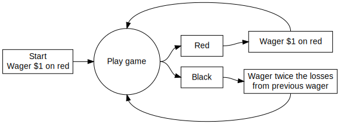
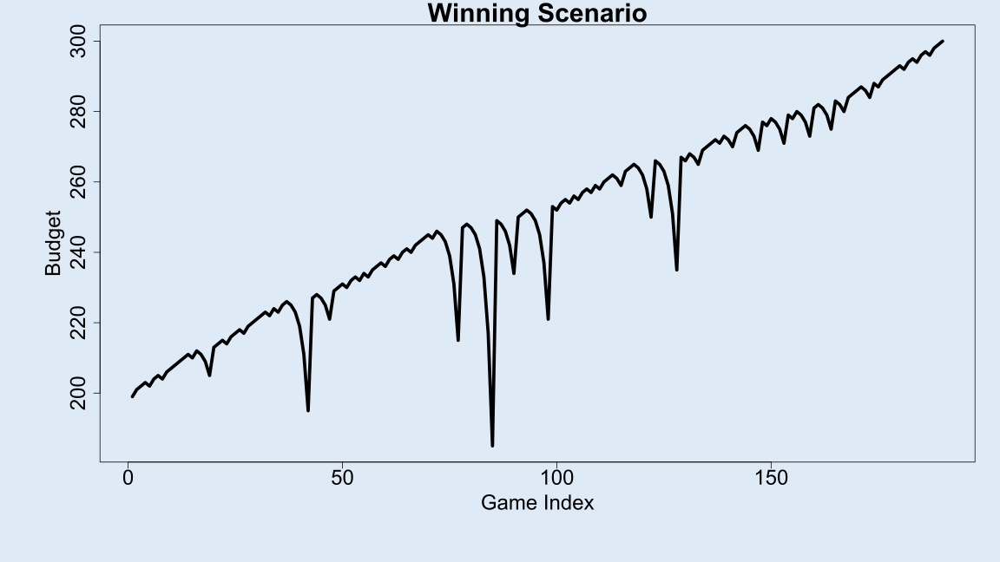
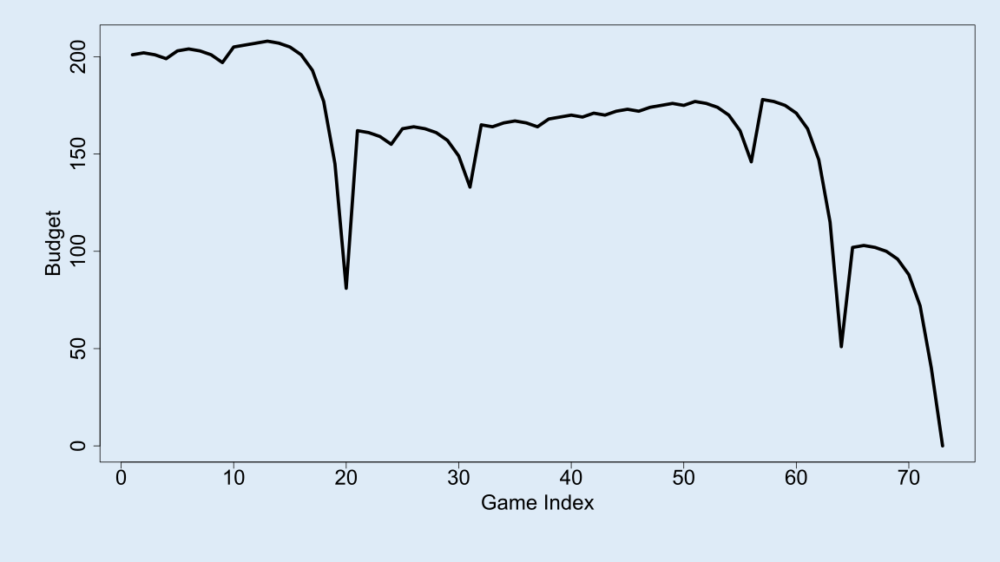
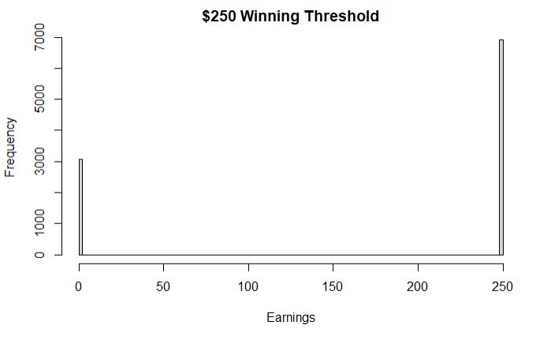
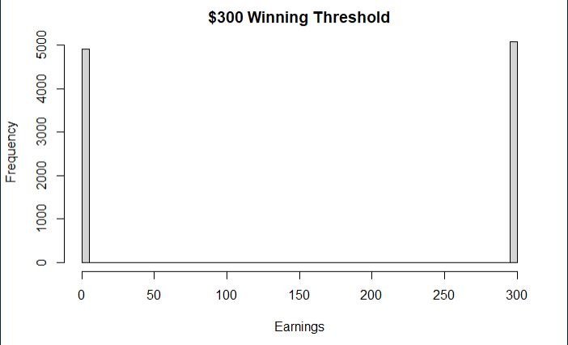
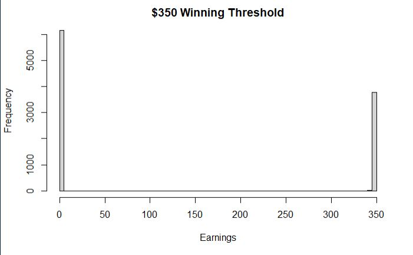
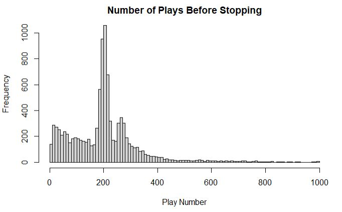

writeup
================
Cam Rondeau
9/1/2021

## The Martingale Strategy in Roulette

### Overview

The Martingale strategy is a common strategy used in betting to try and
guarantee a profit. In this strategy, the bettor simply doubles their
bet after every loss, which theoretically will always result in the
bettor eventually recouping their losses and netting a small profit. In
the game of roulette, the Martingale strategy can be demonstrated by a
bettor putting $1 on red. If the bet loses, the player wagers twice the
amount they lost on red again. If the bet wins, the player keeps their
$1 and places another $1 bet on red and repeats. This can be seen in the
graphic below:

### Operating Characteristics

There are several operating characteristics that contribute to the
possible outcomes of the Martingale strategy in roulette. The main
factors that need to be considered are the following:

-   ***Stopping rule***
    -   The player will stop betting once he/she has ***W*** dollars
    -   The player will stop betting once he/she is bankrupt
    -   The player will stop betting once he/she completes ***L***
        wagers
-   ***Starting budget***
    -   The player starts with ***B*** dollars, and cannot wager more
        money than he/she has.
-   ***Maximum Wager***
    -   The casino has a maximum bet of ***M*** dollars. If the strategy
        directs the player to wager more than M dollars, then the player
        will only wager M dollars.

For the purposes of this blog, the following parameters have been set:

| Parameter | Description                     |             Starting value             |
|:---------:|:--------------------------------|:--------------------------------------:|
|   **B**   | Starting budget                 |                  $200                  |
|   **W**   | Winnings threshold for stopping | $300 (Starting budget + $100 winnings) |
|   **L**   | Time threshold for stopping     |               1000 plays               |
|   **M**   | Casino’s maximum wager          |                  $100                  |

### Testing the Martingale Strategy

Using computer simulation, we can calculate the average earnings of a
better that uses this strategy. To do so, we first need to create code
that simulates one single walk through of the Martingale strategy. This
code will take the parameters listed above and will simulate roulette
spins until either the player is bankrupt, the player reaches their
winning threshold, or the player hits their time threshold for stopping.
Once one of these events is reached, the code returns the history of the
player’s budget, which is a list that contains the player’s budget after
each roulette spin until stopping. Assuming the parameters above, the
final budget will either be $0 (the player is bankrupt), $300 (the
player reached their winning threshold), or the budget amount after 1000
plays.

The graphs below show a two separate examples of the earning amounts
across single attempts at the Martingale Strategy. The first plot shows
the earnings of a scenario in which the better reaches their winning
threshold of $300. The second plot shows the earnings in the scenario in
which the bettor goes bankrupt.

### Simulating Average Outcomes

Running the code outlined above will create a single scenario of what
may happen when using the Martingale Strategy. However, to determine the
*average* earning amount when using this strategy, we must simulate a
very large number of single events in order to increase the accuracy of
our results. For this example, we repeat the code of a single Martingale
Strategy scenario 10,000 times, and end up with a list of the final
budget of each individual scenario. From here, we can calculate the
distribution of final budgets, as well as the average final budget that
a player will have when using this strategy. When looking at 10,000
events using the parameters listed above, the probability of walking out
with extra cash is around 0.511. However, the average earning is around
-$46.79. The reason for this is because with the set parameters, when
the player reaches their winning threshold, they only win $100 on net.
When the player goes bankrupt, they lose $200 on net. So while the
player is slightly more likely to succeed when using the Martingale
strategy, the expected earnings is negative with the set parameters.

### Changing the Winning Threshold

To further test the Martingale strategy, we can change the player’s
winning threshold and simulate what the average earning is when the
player wants to win more or less money. For the first example, the
player’s winning threshold has been increased $50 to $350 ($200 + $150
winnings). All other parameters remain the same. When the player’s
winning threshold is $350, the expected earning is now around -$62.11,
which is \~$15 less than when the winning threshold was $300. Similarly,
the probability of winning money is now 0.394, which is \~0.117 less
than the original example.

Next, we will look at how the expected earning changes when the winning
threshold is decreased $50 to $250. After running the simulation with
all other parameters remaining the same, the expected earning is now
around $-24.65, which is \~$22 more than when the winning threshold was
$300. The probability of having positive earnings is 0.701, which is
\~0.19 more than the original example.

As you can see, when the winning threshold is increased, both the
expected earnings and the probability of making money decreases. When
the winning threshold is decreased, the expected earnings and
probability of making money both increase. This makes sense, because
when the winning threshold is closer to the starting budget, it requires
less games to hit that stopping point and have positive earnings. When
the winning threshold is much higher, it requires more games to reach
that limit, creating more opportunities to lose and eventually go
bankrupt.

The histograms below show the distribution of outcomes when the winning
threshold is $250, $300, and $350, respectively. The simulation was run
10,000 for each situation. As you can see, as the winning threshold
increases, the number of times the player walks away with $0 increases
and the number of times the player walks away with their winning
threshold decreases.

### Average Number of Plays Before Stopping

We can also use computer simulation to determine how many games on
average a player will play before stopping. Recalling the stopping rule
above, a player stops when they are bankrupt, when they reach their
winning threshold, or when they reach the maximum number of plays. To do
so, the code must be modified, because we are no longer focused on
earnings; instead we want to know how long it takes to reach a stopping
point. Instead of having the code return the earning of each
playthrough, we will now have the code return the play number at which
the player went bankrupt, hit the winning threshold, or reached the play
limit. We can then rerun that code many times to come up with the
average play number. Using the original parameters above ($200 starting
budget, $300 winning threshold, 1000 play limit, and $100 casino limit),
the simulation found that it took an average of 201 games before
eventually hitting one of the three stopping points. The histogram below
shows the distribution of the number of plays before stopping over
10,000 events.

### Limitations of the Simulation

Although we can use computer simulation to come up with average earnings
and number of plays when using the Martingale strategy, there are still
many factors that come into play in the real world that a computer
simulation cannot imitate. One of these limitations is that the number
of plays is not very practical in real life. Using the parameters above,
it takes an average of 201 games to either go bankrupt or hit your
winning threshold. There’s not many people who are going to have the
determination or stamina to play 201 straight games of roulette, and
there’s a possibility of the casino not allowing that many successive
games as well. Another limitation is that the simulation doesn’t take
into consideration human nature, specifically when the person is losing.
It’s one thing to have a computer strictly follow the steps of the
Martingale strategy, but if a human were to lose many bets in a row,
there’s a high chance they won’t be willing to keep doubling down and
instead will back out or start from the beginning.

### Conclusion

The Martingale strategy is a very popular betting system because it
seems to guarantee a small profit eventually. However, it’s not as
obvious that you can lose money very quickly and may not have enough
money to continue doubling down to the point of recouping your losses.
Through computer simulation, it’s clear that the expected earnings when
using this strategy are almost always negative. It is true that reducing
your winning threshold will increase your chance of winning and your
expected earning, but it will still be negative in the long run, and
overall, this betting strategy should be avoided.
