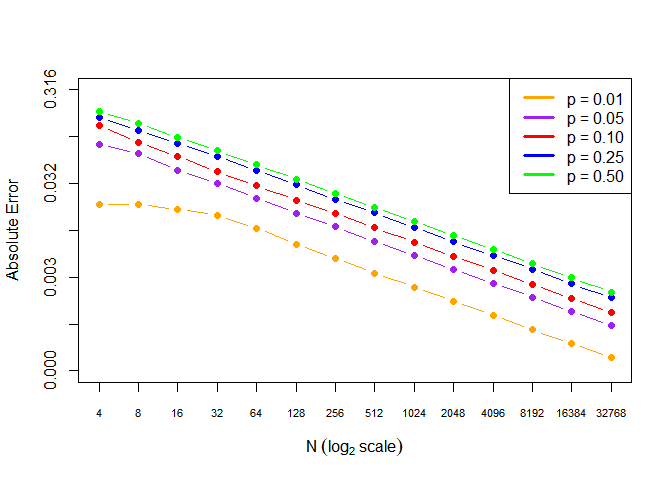
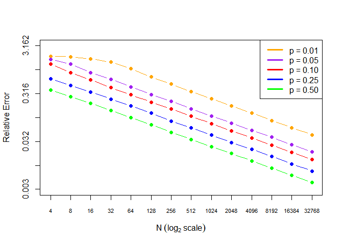

Monte Carlo Error
================
Cam Rondeau
9/12/2021

# Introduction

When using computer simulation, there is always some degree of error in
the answers that are generated. Simulations are a great way to come up
with approximate answers, but there are so many factors to any problem
that can’t be replicated or accounted for by a computer. Computer
Simulations are also finite, so the randomness will always generate a
variance in results. In this blog, I am going to investigate the
relationship between the number of simulation replicates and the
simulation error of the Monte Carlo simulation.

## Background

The Monte Carlo simulation is a model that uses repeated random sampling
to estimate probabilities of uncertain events. This type of simulation
takes an uncertain event, and estimates the probability of certain
outcomes many times to come up with an average probability. When using
the Monte Carlo simulation, there will always be some degree of error in
the probabilities that it generates. To test the relationship of the
number of times the simulation is run and the actual error itself, we
will apply the Monte Carlo simulation to a 14X5 factorial experiment
simulation that estimates the error for each combination of replicate
number (2<sup>2</sup>, 2<sup>3</sup>, …, 2<sup>15</sup>) and probability
(0.01, 0.05, 0.10, 0.25, 0.50). The simulation will generate random
probabilities that we will then compare with the true probability to
determine what the error was. I will go into further detail of the
actual experiment simulation in the Methods section.

# Purpose

It is very important to understand the idea of simulation error.
Computer simulations are a very powerful tool that can be applied to
many different real world problems. Using statistics and probability,
models are created to predict the behavior and potential outcomes of
almost any type of situation. However, the estimates you get from a
computer simulation are not perfect, and they need to be analyzed to
determine the level of error that could arise in each simulation.
Simulations will always give a directionally accurate probability, and
they can be used as very good estimates for potential outcomes, but they
should never be taken as exact answers. In theory, if Monte Carlo
simulations could be applied to an infinite number of replicates, the
estimates they generate would be exact. However, computer simulation is
finite, and the randomness of the experiments will always cause some
variance in the final estimates. As I will get into in the Results
section, it’s evident that as the number of simulation replicates
increases, the simulation error decreases.

We will look at two separate types of simulation error: absolute error
and relative error. Absolute error is defined as the difference between
the actual probability (p), and the probability generated by the
simulation (p̂). This type of error simply shows what the size of the
error is. Relative error, on the other hand, is the difference between
the actual probability (p) and the probability generated by the
simulation (p̂), divided by the actual probability. This type of error
shows the size of the error in proportion to the actual correct value.
Relative probability is important because it allows us to look at how
big the error is in relation to the actual value. For example, a very
small error size for 0.5 probability may be a huge error for 0.01
probability, so the relative error shows how big the error is relative
to each value.

Absolute error = \|*p̂*−*p*\| Relative error = \|*p̂*−*p*\|/*p*.

# Methods

To investigate the relationship between number of replicates and error
size, we will look at a 14X5 factorial experiment simulation. For each
of the probabilities and each of the replicate numbers, the simulation
will calculate an average probability using the rbinom function. To
carry this simulation out, I wrote the following code:

``` r
n <- 2^c(2:15)
p <- c(0.01, 0.05, 0.1, 0.25, 0.5)
abs_error = matrix(NA,nrow=length(p),ncol=length(n))
rel_error = matrix(NA,nrow=length(p),ncol=length(n))

for(i in 1:length(n)){
  for(j in 1:length(p)){
  phat <- rbinom(10000,n[i],p[j])/n[i]
  abs_error[j,i] <- mean(abs(phat-p[j]))
  rel_error[j,i] <- mean(abs(phat-p[j])/p[j])
}
}
```

First, I created vectors of the probabilities and the replicate numbers,
called n and p respectively. Then, I created two empty matrices, one for
absolute error and one for relative error. Both matrices were 5X14.
Then, to actually fill out the matrices and calculate the probabilities,
I wrote a double for loop. The first level of the for loop goes through
each repliate number (2<sup>2</sup>, 2<sup>3</sup>, …, 2<sup>15</sup>),
and the next for loop goes through each probability (0.01, 0.05, 0.10,
0.25, 0.50). This way, every combination of probability and replicate
number will be calculated. The actual calculation inside the for loop
creates a variable “phat” that uses the rbinom function to calculate a
probability based on three variables. First, rbinom generates 10,000
random observations, which is constant across every calculation. Then,
the rbinom takes in the replicate number to determine how many trials it
will run to generate the calculation. Finally, it takes in the
probability value. Once the phat value is calculated for each
combination of probability and replicate number, the absolute error and
relative error are calculated and stored in the previously empty
matrices. Once the code is run, both matrices are filled up with all of
the calculated probabilities.

# Results

It’s clear that as the number of replicates increases, the absolute
error and relative error both decrease. Below is the graph for absolute
error. Unsurprisingly, the bigger the probability, the bigger the error
size. 0.5 has the biggest absolute error, whereas 0.01 has the smallest.
But, as evident across all probabilities, as the replicate size
increases, the absolute error gets smaller and smaller. In theory, if
the simulation was able to run an infinite number of times, the absolute
value would go to 0.

``` r
plot(x=log2(n), y=abs_error[1,], xaxt='n', type="b", col="orange", pch = 16,
     ylab="Absolute Error", xlab = parse(text = "N~(log[2]~scale)"),
     ylim = c(0,0.2))
axis(1, at= log2(n),labels=n, cex.axis = 0.7)
lines(x=log2(n), y= abs_error[2,], col="purple",type="b", pch = 16)
lines(x=log2(n), y= abs_error[3,], col="red",type="b", pch = 16)
lines(x=log2(n), y= abs_error[4,], col="blue",type="b", pch = 16)
lines(x=log2(n), y= abs_error[5,], col="green",type="b", pch = 16)
legend(x = "topright", legend = c("p = 0.01","p = 0.05","p = 0.10","p = 0.25","p = 0.50"), col=c("orange", "purple", "red", "blue", "green"), lwd=3)
```

<!-- -->

Below is the graph of relative error. Similar to absolute error, the
relative error for all probabilities gets smaller and smaller as the
replicate number increases. However, the smaller probabilities have
larger relative errors, which is the opposite of absolute error. This
makes sense, because even though the smaller probabilities had smaller
absolute errors, the size of the error in relation to the actual
probability was more noticeable.

``` r
plot(x=log2(n), y=rel_error[1,], xaxt='n', type="b", col="orange", pch = 16,
     ylab="Relative Error", xlab = parse(text = "N~(log[2]~scale)"),
     ylim = c(0,2))
axis(1, at= log2(n),labels=n, cex.axis = 0.7)
lines(x=log2(n), y= rel_error[2,], col="purple",type="b", pch = 16)
lines(x=log2(n), y= rel_error[3,], col="red",type="b", pch = 16)
lines(x=log2(n), y= rel_error[4,], col="blue",type="b", pch = 16)
lines(x=log2(n), y= rel_error[5,], col="green",type="b", pch = 16)
legend(x = "topright", legend = c("p = 0.01","p = 0.05","p = 0.10","p = 0.25","p = 0.50"), col=c("orange", "purple", "red", "blue", "green"), lwd=3)
```

<!-- -->

It is also helpful to look at the results using a different scale for
the y axis. The graphs above use a linear scale to show how the errors
change as the replicate numbers increase. In the graphs below, the y
scale has been changed to the log<sub>10</sub> scale.

``` r
plot(x=log2(n), y=log10(abs_error[1,]), xaxt='n', yaxt="n", type="b", col="orange", pch = 16,
     ylab="Absolute Error", xlab = parse(text = "N~(log[2]~scale)"),
     ylim = c(-3.5,-.5))
axis(1, at= log2(n),labels=n, cex.axis = 0.7)
axis(2, at= axTicks(2), labels = sprintf("%4.3f", 10^axTicks(2)))
lines(x=log2(n), y= log10(abs_error[2,]), col="purple",type="b", pch = 16)
lines(x=log2(n), y= log10(abs_error[3,]), col="red",type="b", pch = 16)
lines(x=log2(n), y= log10(abs_error[4,]), col="blue",type="b", pch = 16)
lines(x=log2(n), y= log10(abs_error[5,]), col="green",type="b", pch = 16)
legend(x = "topright", legend = c("p = 0.01","p = 0.05","p = 0.10","p = 0.25","p = 0.50"), col=c("orange", "purple", "red", "blue", "green"), lwd=3)
```

<!-- -->

``` r
plot(x=log2(n), y=log10(rel_error[1,]), xaxt='n', yaxt="n", type="b", col="orange", pch = 16,
     ylab="Relative Error", xlab = parse(text = "N~(log[2]~scale)"),
     ylim = c(-2.5,0.5))
axis(1, at= log2(n),labels=n, cex.axis = 0.7)
axis(2, at= axTicks(2), labels = sprintf("%4.3f", 10^axTicks(2)))
lines(x=log2(n), y= log10(rel_error[2,]), col="purple",type="b", pch = 16)
lines(x=log2(n), y= log10(rel_error[3,]), col="red",type="b", pch = 16)
lines(x=log2(n), y= log10(rel_error[4,]), col="blue",type="b", pch = 16)
lines(x=log2(n), y= log10(rel_error[5,]), col="green",type="b", pch = 16)
legend(x = "topright", legend = c("p = 0.01","p = 0.05","p = 0.10","p = 0.25","p = 0.50"), col=c("orange", "purple", "red", "blue", "green"), lwd=3)
```

<!-- -->

These graphs are very interesting because they show that there is a
linear relationship between the simulation error on the log<sub>10</sub>
scale and the replicate number on the log<sub>2</sub> scale.

# Conclusion

After investigating simulation error of the Monte Carlo simulation,
there are a few relationships that stand out the most. First, it is true
that as the number of replicates that a simulation runs increases, both
the absolute and relative errors decrease. This is the major flaw in
computer simulations in general. They are limited to a finite number of
replicates, so the probabilities that they estimate will always vary. If
the simulation was able to run an infinite number of times, there would
be no error, but since the simulation randomly generates numbers a
finite number of times, it will calculate a different probability every
time, one that will never be exactly right. It is also important to look
at the relationship of absolute and relative error. Absolute error
measures the total size of the error, which is often important, but
relative error will measure the size of the error in proportion to the
actual value itself. The absolute error for 0.01 was very small, but the
relative error for 0.01 was the highest. This is especially important
when looking at simulations for real world problems. An absolute error
may seem to be very small or very big, but if the value you are
estimating is also very small or very big, the relative error will be
the true identifier for how meaningful that error really is.
