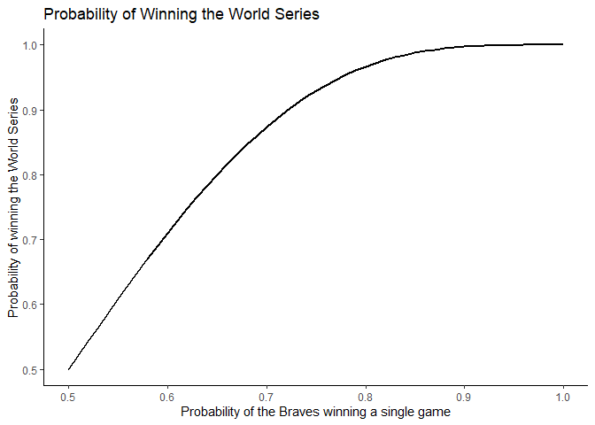
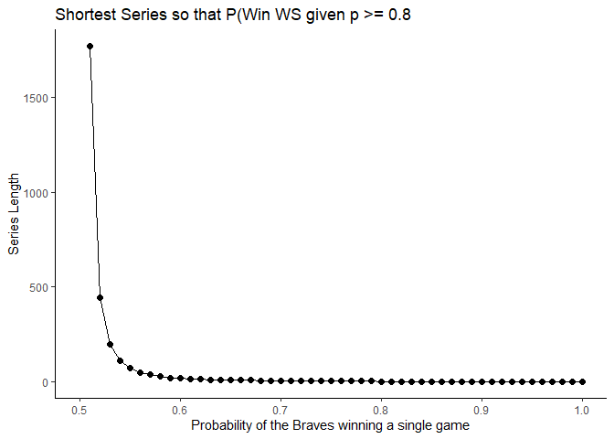

World Series Probability Calculations
================
Cam Rondeau
9/26/2021

# Introduction

In this blog, I am going to answer a series of questions related to
different probability situations related to the World Series. I will
show how you can apply rules of probability and discrete probability
functions to answer each question. For the purpose of this blog, the
World Series is being played between the Atlanta Braves and the New York
Yankees. I will explore how often the better team wins the World Series,
which is the the best of seven games (meaning first team to win four
games wins). To do so, we will assume that the probability that the
Braves win any given name is *P*<sub>*B*</sub>, and the probability that
the Yankees win any given game is
*P*<sub>*Y*</sub> = 1 − *P*<sub>*B*</sub>.

# Probability the Better Team Wins

## *P*<sub>*B*</sub> = 0.55

First, I will calculate the probability that the Braves win the World
Series given that *P*<sub>*B*</sub> = 0.55. To do so, we can use a
negative binomial random variable. We know the Braves need to win 4
games to win the World Series, so we can calculate the probability of
winning the world series by figuring out the probability of losing 3 or
fewer games before winning the 4th game.

``` r
pnbinom(3,4,0.55)
```

    ## [1] 0.6082878

As you can see, the probability of the Braves winning the World Series
given *P*<sub>*B*</sub> = 0.55 is 0.60828.

## *P*<sub>*B*</sub> = X

Now I will explore the probability of the Braves winning the World
Series given *P*<sub>*B*</sub> = X. Similar to the above calculation, we
want to figure out the probability that the Braves lose 3 or fewer games
before winning the 4th game. However, we don’t know the probability that
the Braves win a single game. So, I will graph the World Series
probability given *P*<sub>*B*</sub> = X. To do so, I will calculate the
series probability for a list of single game probabilities going from
0.5 to 1, incrementing by 0.01. Then I will calculate the negative
binomial random variable for each *P*<sub>*B*</sub> using a for loop.

``` r
library(dplyr)
```

    ## 
    ## Attaching package: 'dplyr'

    ## The following objects are masked from 'package:stats':
    ## 
    ##     filter, lag

    ## The following objects are masked from 'package:base':
    ## 
    ##     intersect, setdiff, setequal, union

``` r
library(ggplot2)

#Create vector of probabilities
Pb <- seq(0.5,1,0.01)

#Create empty vector to store calculations
Pws <- rep(NA, length(Pb))

#Calculate probability for every Pb
  for(i in 1:length(Pb)){
    Pws[i] <- pnbinom(3,4,Pb[i])
  }

#Store as data frame
graph_Pb_Pws <- data.frame(Pb, Pws) 

#Graph
ggplot(graph_Pb_Pws, aes(x=Pb,y=Pws)) + geom_line(size=1) +
  labs(title="Probability of Winning the World Series",
       x="Probability of the Braves winning a single game",
       y="Probability of winning the World Series") +
  theme_classic()
```

<!-- -->

As you can see from the graph, the higher the probability to win a
single game, the higher the probability to win the World Series. It’s
also worth noting that the graph intersects the point (0.5,0.5). This is
because if every game has even probability, the series will too. Once
the probability of winning a single game goes above or below 0.5, so
does the probability of winning the World Series.

# Shortest Series Length Given Conditional Probability

Now I want to investigate series lengths given a conditional
probability. Specifically, I will show what the shortest series length
is so that *P*(Braves win World Series\|*P*<sub>*B*</sub> = .55) ≥ 0.8.
Now the variable in question is the number of games. We know that
*P*<sub>*B*</sub> = .55. I will denote N as the number of games in the
series. We can again figure out this solution using the negative
binomial random variable.

For a best of N game series, we know that N needs to be odd because
there can’t be any ties. We can then use integer division to calculate
the clinching number of games. Specifically, if we take N %/% 2 + 1, we
will get the number of games needed to win the Series, which is really
just N / 2 rounded up. For the pnbinom function, we can use N %/% 2 to
calculate the number of games the Braves can lose before winning the
clinching game of the series.

``` r
#Create a vector of odd series lengths (500 max is arbitrary)
N_list <- seq(7,500,2)

#Create empty vector to store probability outcomes
P_list <- rep(NA, length(N_list))

#Calculate probability of winning World Series for each N
for(i in 1:length(N_list)){
  clinch <- N_list[i]%/%2 + 1
  losses <- N_list[i]%/%2
  P_list[i] <- pnbinom(losses, clinch, 0.55)
}
```

Now that I have a vector with the probabilities of the Braves winning a
best of N game series for a range of N’s, I can manipulate the vector to
determine the shortest series length so that *P*(Braves win World
Series\|*P*<sub>*B*</sub> = .55) ≥ 0.8

``` r
#Create empty array to figure out closest probability >= 80
N_80 <- rep(NA, length(P_list))

#Subtract 0.8 from every probability to be able to find the smallest positive value.
for (i in 1:length(N_80)){
  N_80[i] <- P_list[i]-0.8
}

#Store above calculation as data frame
N_df <- data.frame(N_list, N_80) 

#Filter and sort the calculations to find the smallest positive value, and return N
N_df_80 <- N_df %>% filter(N_80 > 0) %>% arrange(N_80) 
N_df_80[1,1]
```

    ## [1] 71

Based on the above calculation, the shortest series length so that
*P*(Braves win World Series\|*P*<sub>*B*</sub> = .55) ≥ 0.8 is 71 games.

Now suppose that we don’t know *P*<sub>*B*</sub>. I will create a plot
showing how the shortest series length so that *P*(Braves win World
Series\|*P*<sub>*B*</sub> = *x*) ≥ 0.8 changes as you change
*P*<sub>*B*</sub>.

To do this, I will do a similar calculation as the above, however
instead of creating data frames for each probability, I will create a
break rule so that the process is more repeatable. To do so, I created
two for loops - one that goes through the probability vector and one
that goes through the list of series lengths. I then calculate the
pnbinom with every combination of probability and series length, and
once the probability is &gt;= 0.8, I add the series length to the final
vector P\_80. Once I have all the shortrest series length, I created a
plot.

``` r
#Create vector of probabilities
Pb <- seq(0.5,1,0.01)

#Create a vector of odd series lengths (999 max is arbitrary)
N_list <- seq(1,9999,2)

#Create empty vector to store calculations
P_80 <- rep(NA, length(Pb))

#Calculate minimumm probability >- 0.8, and add to P_80 vector
for(i in 1:length(Pb)){
  for(j in 1:length(N_list)){
  clinch <- N_list[j]%/%2 + 1
  losses <- N_list[j]%/%2
  prob <- pnbinom(losses, clinch, Pb[i])
  if(prob>=.80){
    P_80[i] <- N_list[j]
    break
  }
  }
}

#Store above calculation as data frame
P_80_df <- data.frame(Pb, P_80)

#Create plot
ggplot(P_80_df, aes(x=Pb,y=P_80)) + geom_point(size=2) +
  geom_line(size=0.5) +
  labs(title="Shortest Series so that P(Win WS given p >= 0.8",
       x="Probability of the Braves winning a single game",
       y="Series Length") +
  theme_classic()
```

    ## Warning: Removed 1 rows containing missing values (geom_point).

    ## Warning: Removed 1 row(s) containing missing values (geom_path).

<!-- -->

As you can see in the graph, as the probability increases, the series
length so that *P*(Braves win World
Series\|*P*<sub>*B*</sub> = *x*) ≥ 0.8 gets closer to 1. Once the
probability of the Braves winning a single game is equal to 0.8, then it
only requires one game for the World Series probability to also equal
0.8. As the probability is close to 0.5, the series length approaches
infinity, because the individual games are much more even so you need a
very large sample size to take advantage of a very small advantage in
single game probabilities.

# Calculating Exact Outcome

Now I will calculate the probability that the single game probability is
0.55 given that the Braves won the World Series in exactly 7 games,
assuming that the single game probability is either 0.55 or 0.45. To
figure out *P*(*P*<sub>*B*</sub> = 0.55\|Braves win World Series in 7
games), we can use a cross table and Bayes rule to determine what the
actual calculation is.

According to Bayes rule, Pr(A \| B) = (Pr(B \| A)Pr(A)) / Pr(B). So, to
figure out *P*(*P*<sub>*B*</sub> = 0.55\|Braves win World Series in 7
games), we need to calculate (*P*(Braves win World Series in 7
games\|*P*<sub>*B*</sub> = 0.55) \* *P*(*P*<sub>*B*</sub> = 0.55)) /
*P*(Braves win World Series in 7 games).

First, I will calculate *P*(Braves win World Series in 7
games\|*P*<sub>*B*</sub> = 0.55). This can be done using the negative
binomial random variable, where we know that the Braves must lose 3
games before winning their 4th, and the probability of the single game
is 0.55.

``` r
dnbinom(3,4,0.55)
```

    ## [1] 0.1667701

This gives us a 0.16677 probability that the Braves win in 7 games given
that their single game probability is 0.55.

Next, I will calculate *P*(*P*<sub>*B*</sub> = 0.55). This equals 0.5,
since there are only two possible single game probabilities, as
determined by the question stated above.

Finally, I will calculate *P*(Braves win World Series in 7 games), which
is equal to ((*P*(Braves win World Series in 7
games\|*P*<sub>*B*</sub> = 0.55) + (*P*(Braves win World Series in 7
games\|*P*<sub>*B*</sub> = 0.45)/2). So I can use the negative random
variable again to calculate this value.

``` r
(dnbinom(3,4,0.45) + dnbinom(3,4,0.55))/2
```

    ## [1] 0.1516092

This gives us a 0.1516 probability that the Braves win in 7 games.

We can then use Bayes rule to determine the final probability.

``` r
(dnbinom(3,4,0.55)*0.5)/((dnbinom(3,4,0.55) + dnbinom(3,4,0.45))/2)
```

    ## [1] 0.55

As you can see, the probability that the single game probability is 0.55
given that the Braves won the World Series in exactly 7 games is 0.55.
