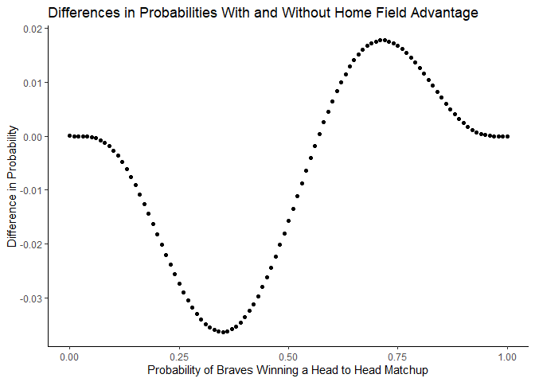
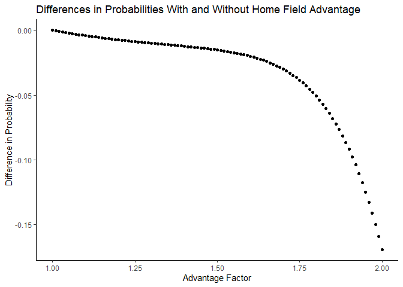

Home Field Advantage in the World Series
================
Cam Rondeau
10/1/2021

# Introduction

In my last blog post, I investigated the probability that the better
team won the World Series, as well as how the series length effected
that probability. In this blog post, I will determine how much of an
impact home field advantage has on winning the World Series. By
definition, the home field advantage is the edge which a team may have
when playing a game at its home stadium. For example, in the World
Series between the Braves and the Yankees, the Braves have home field
advantage in head to head match ups in Atlanta, and the Yankees have it
in New York.

# Methods

To investigate how much of an impact home field advantage has on winning
the World Series, I will use simulation and analytic methods to compare
the probability of winning the World Series with and without home field
advantage. In the World Series match up between the Braves and the
Yankees, the two possible schedules for each game of the series are as
follows (NYC = New York City, ATL = Atlanta):

| Overall advantage | Game 1 | Game 2 | Game 3 | Game 4 | Game 5 | Game 6 | Game 7 |
|:-----------------:|:------:|:------:|:------:|:------:|:------:|:------:|:------:|
|      Braves       |  ATL   |  ATL   |  NYC   |  NYC   |  NYC   |  ATL   |  ATL   |
|      Yankees      |  NYC   |  NYC   |  ATL   |  ATL   |  ATL   |  NYC   |  NYC   |

For the calculations, we are going to let *P*<sub>*B*</sub> be the
probability that the Braves win a single head-to-head match-up with the
Yankees, under the assumption that home field advantage doesn’t exist.
*P*<sub>*B*</sub><sup>*H*</sup> will denote the probability that the
Braves win a single head-to-head match-up in Atlanta (H for home).
*P*<sub>*B*</sub><sup>*A*</sup> will denote the probability that the
Braves win a single head-to-head match-up in New York (A for away).

| Game location |   No advantage    | Advantage                                                            |
|:-------------:|:-----------------:|:---------------------------------------------------------------------|
|      ATL      | *P*<sub>*B*</sub> | *P*<sub>*B*</sub><sup>*H*</sup> = *P*<sub>*B*</sub> \* 1.1           |
|      NYC      | *P*<sub>*B*</sub> | *P*<sub>*B*</sub><sup>*A*</sup> = 1 − (1 − *P*<sub>*B*</sub>) \* 1.1 |

# Probability Braves Win World Series when the sequence of game locations is {NYC, NYC, ATL, ATL, ATL, NYC, NYC}

## Analytically

First, I will analytically compute the probability that the Braves win
the World Series with and without home field advantage when
*P*<sub>*B*</sub> = 0.55. First, as I investigated in my last post, we
can use a negative binomial random variable to calculate the probability
the Braves win without a home field advantage. We know the Braves need
to win 4 games to win the World Series, so we can calculate the
probability of winning the world series by figuring out the probability
of losing 3 or fewer games before winning the 4th game, which is as
follows:

``` r
pnbinom(3,4,0.55)
```

    ## [1] 0.6082878

Next, to calculate the probability the Braves win with home field
advantage, we cannot use the negative binomial function because the
probability of winning each game is not constant, as it changes
depending on where the game is being played. In the following code, I
take a .csv file that has every outcome of the World Series, which is
stored as `apo`. I then store the schedule of games as `hfi`, as well as
the probabilities of the Braves winning a single game at home and away.
Then a nested for loop goes through each possible World Sevres outcome
and calculates the probability of winning that specific game based on
where the game is being played. Then, it multiplies each individual game
probability of a given outcome, and that product is stored as a new
variable in the `apo` data frame. Each product represents the
probability of that specific outcome happening, which means that the sum
of all products equals 1, and the sum of all winning outcomes equals the
probability that the Braves win the World Series given that home field
advantage matters and the game locations is {NYC, NYC, ATL, ATL, ATL,
NYC, NYC}.

``` r
require(dplyr)
```

    ## Loading required package: dplyr

    ## Warning: package 'dplyr' was built under R version 4.1.3

    ## 
    ## Attaching package: 'dplyr'

    ## The following objects are masked from 'package:stats':
    ## 
    ##     filter, lag

    ## The following objects are masked from 'package:base':
    ## 
    ##     intersect, setdiff, setequal, union

``` r
require(data.table)
```

    ## Loading required package: data.table

    ## Warning: package 'data.table' was built under R version 4.1.2

    ## 
    ## Attaching package: 'data.table'

    ## The following objects are masked from 'package:dplyr':
    ## 
    ##     between, first, last

``` r
# Get all possible outcomes
apo <- fread("./all-possible-world-series-outcomes.csv")

# Home field indicator
hfi <- c(0,0,1,1,1,0,0) #{NYC, NYC, ATL, ATL, ATL, NYC, NYC}

# P_B
pb <- 0.55
advantage_multiplier <- 1.1 # Set = 1 for no advantage
pbh <- pb*advantage_multiplier
pba <- 1 - (1 - pb)*advantage_multiplier

# Calculate the probability of each possible outcome
apo[, p := NA_real_] # Initialize new column in apo to store prob
for(i in 1:nrow(apo)){
  prob_game <- rep(1, 7)
  for(j in 1:7){
    p_win <- ifelse(hfi[j], pbh, pba)
    prob_game[j] <- case_when(
        apo[i,j,with=FALSE] == "W" ~ p_win
      , apo[i,j,with=FALSE] == "L" ~ 1 - p_win
      , TRUE ~ 1
    )
  }
  apo[i, p := prod(prob_game)] # Data.table syntax
}

# Probability of winning the World Series
p_analytic_hfa <- apo[, sum(p), overall_outcome][1,2]
p_analytic_hfa
```

    ##          V1
    ## 1: 0.604221

As you can see, the probability the Braves win the World Series without
considering home field advantage is 0.608, and the probability of them
winning with home field advantage given the set game locations is 0.604.
That means when the schedule of game locations is {NYC, NYC, ATL, ATL,
ATL, NYC, NYC}, the Braves’ probability of winning the World Series when
home field is a factor is 0.004 less than when home field doesn’t
matter. This makes sense, because the Braves play more away games than
home games, so they have a smaller probability of winning 4 of the games
and only a higher probability of winning in 3 of the games.

## Simulation

Now I want to calculate the same probabilities as above, only this time
I will use simulation instead of analytical solutions. To do this, I
will first use the same variables above to store the schedule of games
(`hfi`), as well as the probabilities of winning at home (`pbh`) and
away (`pba`). Then, I will create a function that uses the given
probability of each game and uses rbinom to randomly calculate whether
or not the Braves win each game or not depending on that game’s
probability. Then, once I have a list of outcomes, I will return True if
the sum of the outcome is greater than or equal to 4, meaning that the
Braves won at least 4 games and won the World Series, and I will return
False if they won 3 or less and loss the World Series. Then, I will use
replicate to run the one_series function 100,000 times, creating a
vector of True’s and False’s.

``` r
#Create one outcome of the WS given the set game schedule. Takes the single game probability and the home field advantage multiplier as paramters, returns True if the Braves win the WS and False if they lose
hfi <- c(0,0,1,1,1,0,0)

one_series <- function(pb,advantage_multiplier){
  pb <- pb
  advantage_multiplier <- advantage_multiplier
  pbh <- pb*advantage_multiplier
  pba <- 1 - (1 - pb)*advantage_multiplier
  series <- rep(NA,7)
  for(i in 1:7){
   p_win <- ifelse(hfi[i], pbh, pba)
   series[i] <- rbinom(1,1,p_win)
}
  sum(series)>=4
}
```

Then, I will use replicate to run the one_series function 100,000 times,
creating a vector of True’s and False’s. Taking the mean of that vector
will calculate the simulated probability that the Braves win the World
Series. I can complete this simulation twice, once when home field
advantage does not matter, so `advantage_multiplier` is 1, and once when
it does matter, and `advantage_multiplier` is 1.1.

``` r
#Simulate probabily of Braves winning when home field does not matter
replicates_nhfa <- replicate(100000,one_series(0.55,1))
mean(replicates_nhfa)
```

    ## [1] 0.60694

``` r
#Simulate probabily of Braves winning when home field does matter
replicates_hfa <- replicate(100000,one_series(0.55,1.1))
mean(replicates_hfa)
```

    ## [1] 0.60447

As you can see, the simulated probability of the Braves winning without
home field advantage is still slightly higher than winning with home
field advantage, and the numbers align with our analytical solution.

# Error in the Above Simulation

As we know, all computer simulations generate some degree of error. We
can classify the simulation error into the following two types:

Absolute error = \|*p̂*−*p*\|

Relative error = \|*p̂*−*p*\|/*p*.

I will calculate the absolute and relative error for the probability
that the Braves win without home field advantage and with home field
advantage

## Without Home Field Advantage

In this scenario, *p* represents the actual, analytical probability we
calculated in question one using the pnbinom function, which I will
denote `p_analytic_nhfa`. *p̂* represents the probability we calculated
via simulation, which I will denote `p_sim_nhfa`. To determine the
absolute and relative errors, we can run the following code, which
incorporates the code above:

``` r
p_analytic_nhfa <- pnbinom(3,4,0.55)
p_sim_nhfa <- mean(replicate(100000,one_series(0.55,1)))
abs_error_nhfa = abs(p_sim_nhfa - p_analytic_nhfa)
rel_error_nhfa = abs(p_sim_nhfa - p_analytic_nhfa)/p_analytic_nhfa

abs_error_nhfa
```

    ## [1] 0.002387797

``` r
rel_error_nhfa
```

    ## [1] 0.003925439

## With Home Field Advantage

To calculate the absolute and relative errors for the situation in which
there is home field advantage, I can use again use the code from above.
This time, the analytical probability of the Braves winning with home
field advantage is stored in the data frame from part 1.

``` r
p_analytic_hfa <- p_analytic_hfa[1,1]
p_sim_hfa <- mean(replicate(100000,one_series(0.55,1.1)))
abs_error_hfa = abs(p_sim_hfa - p_analytic_hfa)
rel_error_hfa = abs(p_sim_hfa - p_analytic_hfa)/p_analytic_hfa

abs_error_hfa
```

    ##              V1
    ## 1: 0.0003690284

``` r
rel_error_hfa
```

    ##              V1
    ## 1: 0.0006107507

# Does the difference in probabilities (with vs without home field advantage) depend on *P*<sub>*B*</sub>?

Now, I will determine whether or not the difference in probabilities
with vs without home field advantage depends on the initial single game
probability *P*<sub>*B*</sub>. To do this, I will use the same
calculation from part 1, and put it inside a function. Now, you call the
function and give it a *P*<sub>*B*</sub> and an advantage factor and it
will return the probability of winning the World Series under those
conditions. Then, I will calculate the probability of winning the World
Series with and without home field advantage for every *P*<sub>*B*</sub>
between 0 and 1, at 0.01 intervals.

``` r
# Home field indicator
hfi <- c(0,0,1,1,1,0,0) #{NYC, NYC, ATL, ATL, ATL, NYC, NYC}

#Create function that takes probability and advantage multiplier and returns probability
p_series_win <- function(pb, advantage_multiplier){
  pbh <- pb*advantage_multiplier
  pba <- 1 - (1 - pb)*advantage_multiplier

  # Calculate the probability of each possible outcome
  apo[, p := NA_real_] # Initialize new column in apo to store prob
  for(i in 1:nrow(apo)){
    prob_game <- rep(1, 7)
    for(j in 1:7){
      p_win <- ifelse(hfi[j], pbh, pba)
      prob_game[j] <- case_when(
          apo[i,j,with=FALSE] == "W" ~ p_win
        , apo[i,j,with=FALSE] == "L" ~ 1 - p_win
        , TRUE ~ 1
      )
    }
    apo[i, p := prod(prob_game)] # Data.table syntax
  }
  return(as.double(apo[, sum(p), overall_outcome][1,2]))
}

#Create vector of probabilities
Pb_list <- seq(0,1,0.01)

#Create empty vector to store the differences in probabilities 
Pws <- rep(NA, length(Pb_list))

#Loop through probabilities and calculate the difference in home field vs non home field probabilities
for(i in 1:length(Pb_list)){
  p_nhfa = p_series_win(Pb_list[i], 1)
  p_hfa = p_series_win(Pb_list[i], 1.1)
  Pws[i] <- p_hfa-p_nhfa
}

#Store data as a data frame
Pb_graph <- as.data.frame(cbind(Pb_list, Pws))
```

Now that I have a data frame that includes the differences in
probabilities with vs without home field advantage for multiple
*P*<sub>*B*</sub>, I can create a graph to show how *P*<sub>*B*</sub>
effects things.

``` r
library(ggplot2)
```

    ## Warning: package 'ggplot2' was built under R version 4.1.2

``` r
ggplot(Pb_graph, aes(x=Pb_list, y=Pws)) + geom_point() +
  labs(title="Differences in Probabilities With and Without Home Field Advantage",
       x="Probability of Braves Winning a Head to Head Matchup",
       y="Difference in Probability") +
  theme_classic()
```

<!-- -->

As you can see, the differences in probabilities of winning the World
Series with and without home field advantage varies as the probability
of winning a head to head match up increases. When *P*<sub>*B*</sub> is
very small, the difference is also very small. As *P*<sub>*B*</sub>
starts to increase, the difference in probabilities decreases (the
magnitude increases), meaning that if the Braves had a low chance of
winning a head to head match up, the probability of them winning the
World Series is higher when there is no home field advantage. As
*P*<sub>*B*</sub> increases past 0.5, the difference also increases,
meaning their likelihood of winning the World Series is higher when
there is home field advantage. The difference then comes back down as
*P*<sub>*B*</sub> approaches 1 because home field doesn’t have a very
big impact.

# Does the difference in probabilities (with vs without home field advantage) depend on the advantage factor?

Now I want investigate how the home field advantage factor effects the
difference in probabilities with vs without home field advantage. To do
this, I can use the same `p_series_win` function as above, and this time
run the for loop on an iteration of advantage factors to determine how
that changes the difference, assuming that *P*<sub>*B*</sub> = 0.55

``` r
#Create vector of probabilities
hfa_list <- seq(1,2,0.01)

#Create empty vector to store the differences in advantage factors 
hfa <- rep(NA, length(Pb_list))

#Loop through probabilities and calculate the difference in home field vs non home field probabilities
for(i in 1:length(Pb_list)){
  p_nhfa = p_series_win(0.55, 1)
  p_hfa = p_series_win(0.55, hfa_list[i])
  hfa[i] <- p_hfa-p_nhfa
}

#Store data as a data frame
hfa_graph <- as.data.frame(cbind(hfa_list, hfa))
```

Now that I have a data frame that includes the differences in
probabilities with vs without home field advantage for multiple
advantage factors, I can create a graph.

``` r
library(ggplot2)
ggplot(hfa_graph, aes(x=hfa_list, y=hfa)) + geom_point() +
  labs(title="Differences in Probabilities With and Without Home Field Advantage",
       x="Advantage Factor",
       y="Difference in Probability") +
  theme_classic()
```

<!-- --> As you can
see, as the advantage factor increases, the difference in probabilities
between home field advantage and non home field advantage decreases at a
rapid rate. This makes sense, because as the home field advantage gets
bigger and bigger, the probability of winning the Word Series with home
field advantage gets smaller and smaller for Atlanta since New York has
more home games than Atlanta, so the Yankees have a much higher
probability for more games. If the game locations were {ATL, ATL, NYC,
NYC, NYC, ATL, ATL}, the probability of the Braves winning the World
Series as the advantage factor increased would also increase.
