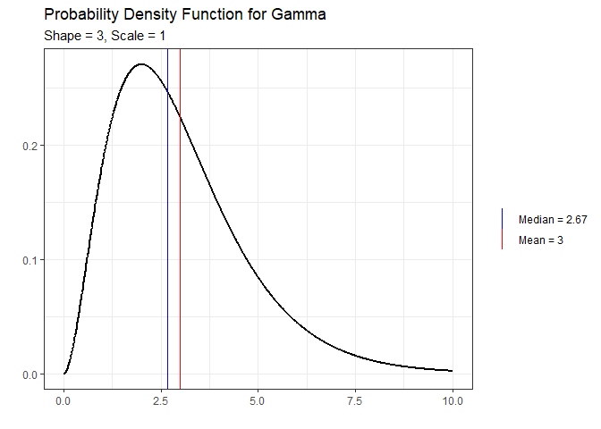
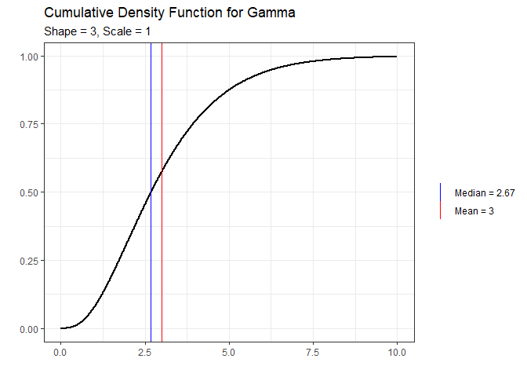
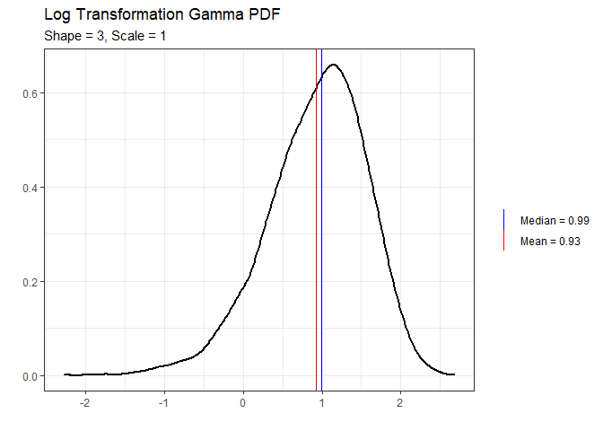
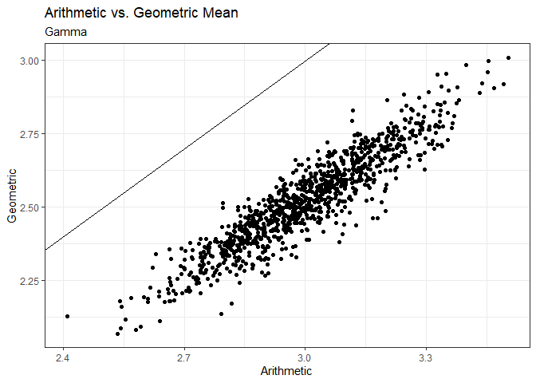
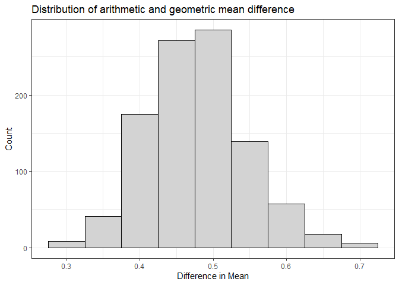
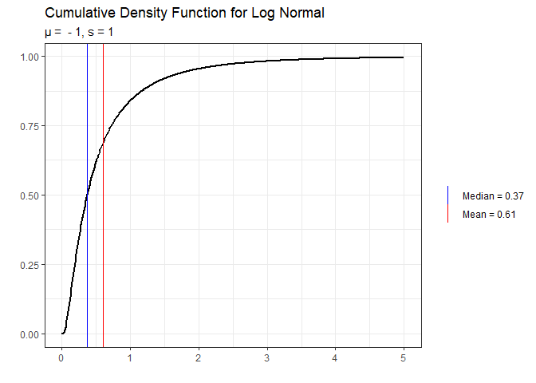
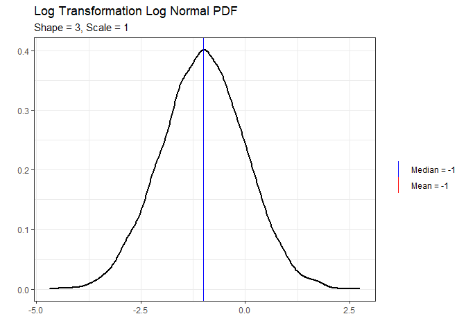
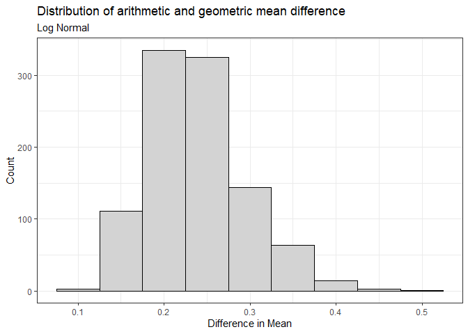
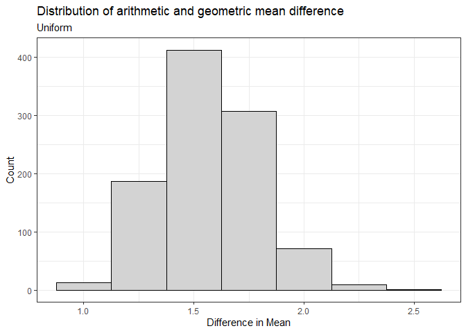

# Introduction

When analyzing biological data, it is common to log transform data that
represents concentrations or dose response. In this blog, I will answer
a series of questions related to the transformation of data, using both
analytical methods and simulation. To answer these questions, I will
investigate three separate transformations: gamma, log normal, and
uniform. I will create a PDF and CDF for each distribution, a PDF and
CDF for the log of each distribution, and then simulate the geometric
and arithmetic mean of each.

# Distribution 1

*X* ∼ GAMMA(shape = 3, scale = 1)

## Question 1

    library(ggplot2)

    ## Warning: package 'ggplot2' was built under R version 4.1.2

    sample <- seq(0,10,.01)

    #Create PDF
    gamma_pdf <- dgamma(sample, shape=3)
    gamma_pdf_df <- data.frame(sample, gamma_pdf)
    ggplot(gamma_pdf_df, aes(x=sample, y=gamma_pdf)) + 
      geom_line(size=1) +
      labs(title="Probability Density Function for Gamma",
           subtitle="Shape = 3, Scale = 1",
           x="",
           y="",
           col="") +
      theme_bw() +
      geom_vline(aes(xintercept = 3*1,col="red")) +
      geom_vline(aes(xintercept = qgamma(0.5,3,1), col="blue")) +
      scale_colour_manual(values=c("blue", "red"), labels=c(paste0("Median = ", round(qgamma(0.5,3,1),2)), paste0("Mean = ", 3)))

    #Create CDF
    gamma_cdf <- pgamma(sample, shape=3)
    gamma_cdf_df <- data.frame(sample, gamma_cdf)
    ggplot(gamma_cdf_df, aes(x=sample, y=gamma_cdf)) + 
      geom_line(size=1) +
      labs(title="Cumulative Density Function for Gamma",
           subtitle="Shape = 3, Scale = 1",
           x="",
           y="",
           colour="") +
      theme_bw() +
      geom_vline(aes(xintercept = 3*1,col="red")) +
      geom_vline(aes(xintercept = qgamma(0.5,3,1), col="blue")) +
      scale_colour_manual(values=c("blue", "red"), labels=c(paste0("Median = ", round(qgamma(0.5,3,1),2)), paste0("Mean = ", 3)))

## Question 2

    x <- rgamma(10000, shape=3, scale=1)
    y <- log(x)
    pdf_df <- data.frame(x,y)

    #Create PDF
    ggplot(pdf_df, aes(y)) + 
      geom_density(size=1) +
      labs(title="Log Transformation Gamma PDF",
           subtitle="Shape = 3, Scale = 1",
           x="",
           y="",
           col="") +
      theme_bw() +
      geom_vline(aes(xintercept = mean(y),col="red")) +
      geom_vline(aes(xintercept = median(y), col="blue")) +
      scale_colour_manual(values=c("blue", "red"), labels=c(paste0("Median = ", round(median(y),2)), paste0("Mean = ", round(mean(y),2))))

    #Create CDF
    ggplot(pdf_df, aes(y)) + 
      stat_ecdf(size=1) +
      labs(title="Log Transformation Gamma CDF",
           subtitle="Shape = 3, Scale = 1",
           x="",
           y="",
           col="") +
      theme_bw() +
      geom_vline(aes(xintercept = mean(y),col="red")) +
      geom_vline(aes(xintercept = median(y), col="blue")) +
      scale_colour_manual(values=c("blue", "red"), labels=c(paste0("Median = ", round(median(y),2)), paste0("Mean = ", round(mean(y),2))))

## Question 3

    arithmetic <- rep(NA, 1000)
    geometric <- rep(NA, 1000)

    for(i in 1:1000){
      sample <- rgamma(100,3,1)
      arithmetic[i] = mean(sample)
      geometric[i] = exp(mean(log(sample)))
      }

    plot_mean <- data.frame(arithmetic, geometric)

    ggplot(plot_mean, aes(arithmetic, geometric)) + geom_point() +
      labs(title="Arithmetic vs. Geometric Mean",
           subtitle="Gamma",
           x="Arithmetic",
           y="Geometric") +
      geom_abline(slope=1,intercept=0) +
      theme_bw() 

## Question 4

    mean_diff = rep(NA, 1000)

    for(i in 1:1000){
      mean_diff[i] = arithmetic[i] - geometric[i]
    }

    df_mean_diff <- data.frame(mean_diff)

    ggplot(df_mean_diff, aes(mean_diff)) + geom_histogram(binwidth=0.05, fill="lightgrey", col="black") +
      labs(title="Distribution of arithmetic and geometric mean difference",
           x="Difference in Mean",
           y="Count") +
      theme_bw()

# Distribution 2

*X* ∼ LOG NORMAL(*μ* =  − 1, *σ* = 1)

## Question 1

    sample <- seq(0,5,.01)

    #Create PDF
    lnorm_pdf <- dlnorm(sample, -1)
    lnorm_pdf_df <- data.frame(sample, lnorm_pdf)
    ggplot(lnorm_pdf_df, aes(x=sample, y=lnorm_pdf)) + 
      geom_line(size=1) +
      labs(title="Probability Density Function for Log Normal",
           subtitle="μ =  − 1, σ = 1",
           x="",
           y="",
           col="") +
      theme_bw() +
      geom_vline(aes(xintercept = exp(-1+1/2),col="red")) +
      geom_vline(aes(xintercept = qlnorm(0.5,-1,1), col="blue")) +
      scale_colour_manual(values=c("blue", "red"), labels=c(paste0("Median = ", round(qlnorm(0.5,-1,1),2)), paste0("Mean = ", round(exp(-1+1/2),2))))

    #Create CDF
    lnorm_cdf <- plnorm(sample, -1)
    lnorm_cdf_df <- data.frame(sample, lnorm_cdf)
    ggplot(lnorm_cdf_df, aes(x=sample, y=lnorm_cdf)) + 
      geom_line(size=1) +
      labs(title="Cumulative Density Function for Log Normal",
           subtitle="μ =  − 1, σ = 1",
           x="",
           y="",
           colour="") +
      theme_bw() +
      geom_vline(aes(xintercept = exp(-1+1/2),col="red")) +
      geom_vline(aes(xintercept = qlnorm(0.5,-1,1), col="blue")) +
      scale_colour_manual(values=c("blue", "red"), labels=c(paste0("Median = ", round(qlnorm(0.5,-1,1),2)), paste0("Mean = ", round(exp(-1+1/2),2))))

## Question 2

    x <- rlnorm(10000, -1,1)
    y <- log(x)
    pdf_df <- data.frame(x,y)

    #Create PDF
    ggplot(pdf_df, aes(y)) + 
      geom_density(size=1) +
      labs(title="Log Transformation Log Normal PDF",
           subtitle="Shape = 3, Scale = 1",
           x="",
           y="",
           col="") +
      theme_bw() +
      geom_vline(aes(xintercept = mean(y),col="red")) +
      geom_vline(aes(xintercept = median(y), col="blue")) +
      scale_colour_manual(values=c("blue", "red"), labels=c(paste0("Median = ", round(median(y),2)), paste0("Mean = ", round(mean(y),2))))

    #Create CDF
    ggplot(pdf_df, aes(y)) + 
      stat_ecdf(size=1) +
      labs(title="Log Transformation Log Normal CDF",
           subtitle="Shape = 3, Scale = 1",
           x="",
           y="",
           col="") +
      theme_bw() +
      geom_vline(aes(xintercept = mean(y),col="red")) +
      geom_vline(aes(xintercept = median(y), col="blue")) +
      scale_colour_manual(values=c("blue", "red"), labels=c(paste0("Median = ", round(median(y),2)), paste0("Mean = ", round(mean(y),2))))

## Question 3

    arithmetic_ln <- rep(NA, 1000)
    geometric_ln <- rep(NA, 1000)

    for(i in 1:1000){
      sample <- rlnorm(100,-1,1)
      arithmetic_ln[i] = mean(sample)
      geometric_ln[i] = exp(mean(log(sample)))
      }

    plot_mean <- data.frame(arithmetic_ln, geometric_ln)

    ggplot(plot_mean, aes(arithmetic_ln, geometric_ln)) + geom_point() +
      labs(title="Arithmetic vs. Geometric Mean",
           subtitle="Log Normal",
           x="Arithmetic",
           y="Geometric") +
      geom_abline(slope=1,intercept=0) +
      theme_bw()

## Question 4

    mean_diff_ln = rep(NA, 1000)

    for(i in 1:1000){
      mean_diff_ln[i] = arithmetic_ln[i] - geometric_ln[i]
    }

    df_mean_diff_ln <- data.frame(mean_diff_ln)

    ggplot(df_mean_diff_ln, aes(mean_diff_ln)) + geom_histogram(binwidth=0.05, fill="lightgrey", col="black") +
      labs(title="Distribution of arithmetic and geometric mean difference",
           subtitle="Log Normal",
           x="Difference in Mean",
           y="Count") +
      theme_bw()

# Distribution 3

*X* ∼ UNIFORM(0, 12)

## Question 1

    sample <- seq(0,12,.1)

    #Create PDF
    unif_pdf <- dunif(sample, 0, 12)
    unif_pdf_df <- data.frame(sample, unif_pdf)
    ggplot(unif_pdf_df, aes(x=sample, y=unif_pdf)) + 
      geom_line(size=1) +
      labs(title="Probability Density Function for Uniform",
           x="",
           y="",
           col="") +
      theme_bw() +
      geom_vline(aes(xintercept = 6,col="red")) +
      geom_vline(aes(xintercept = 6, col="blue")) +
      scale_colour_manual(values=c("blue", "red"), labels=c(paste0("Median = ", 6), paste0("Mean = ", 6)))

    #Create CDF
    unif_cdf <- punif(sample, 0, 12)
    unif_cdf_df <- data.frame(sample, unif_cdf)
    ggplot(unif_cdf_df, aes(x=sample, y=unif_cdf)) + 
      geom_line(size=1) +
      labs(title="Cumulative Density Function for Uniform",
           x="",
           y="",
           colour="") +
      theme_bw() +
      geom_vline(aes(xintercept = 6,col="red")) +
      geom_vline(aes(xintercept = 6, col="blue")) +
      scale_colour_manual(values=c("blue", "red"), labels=c(paste0("Median = ",6), paste0("Mean = ", 6)))

## Question 2

    x <- runif(10000, 0,12)
    y <- log(x)
    pdf_df <- data.frame(x,y)

    #Create PDF
    ggplot(pdf_df, aes(y)) + 
      geom_density(size=1) +
      labs(title="Log Transformation Uniform PDF",
           x="",
           y="",
           col="") +
      theme_bw() +
      geom_vline(aes(xintercept = mean(y),col="red")) +
      geom_vline(aes(xintercept = median(y), col="blue")) +
      scale_colour_manual(values=c("blue", "red"), labels=c(paste0("Median = ", round(median(y),2)), paste0("Mean = ", round(mean(y),2))))

    #Create CDF
    ggplot(pdf_df, aes(y)) + 
      stat_ecdf(size=1) +
      labs(title="Log Transformation Uniform CDF",
           x="",
           y="",
           col="") +
      theme_bw() +
      geom_vline(aes(xintercept = mean(y),col="red")) +
      geom_vline(aes(xintercept = median(y), col="blue")) +
      scale_colour_manual(values=c("blue", "red"), labels=c(paste0("Median = ", round(median(y),2)), paste0("Mean = ", round(mean(y),2))))

## Question 3

    arithmetic_u <- rep(NA, 1000)
    geometric_u <- rep(NA, 1000)

    for(i in 1:1000){
      sample <- runif(100,0,12)
      arithmetic_u[i] = mean(sample)
      geometric_u[i] = exp(mean(log(sample)))
      }

    plot_mean <- data.frame(arithmetic_u, geometric_u)

    ggplot(plot_mean, aes(arithmetic_u, geometric_u)) + geom_point() +
      labs(title="Arithmetic vs. Geometric Mean",
           subtitle="Uniform",
           x="Arithmetic",
           y="Geometric") +
      geom_abline(slope=1,intercept=0) +
      theme_bw()

## Question 4

    mean_diff_u = rep(NA, 1000)

    for(i in 1:1000){
      mean_diff_u[i] = arithmetic_u[i] - geometric_u[i]
    }

    df_mean_diff_u <- data.frame(mean_diff_u)

    ggplot(df_mean_diff_u, aes(mean_diff_u)) + geom_histogram(binwidth=0.25, fill="lightgrey", col="black") +
      labs(title="Distribution of arithmetic and geometric mean difference",
           subtitle="Uniform",
           x="Difference in Mean",
           y="Count") +
      theme_bw()

# Part 3

When we looked at the scatter plot of the arithmetic mean and geometric
mean, it was clear that every point on the plot fell below the line of
identity. This tells us that the arithmetic mean is always bigger than
the geometric mean, since the points fall below y=x. We also know that
arithmetic mean is equal to E(X), and geometric mean is equal to
exp(E(log(X))). So, we have the following:
*E*\[*X*\] &gt; *e**E*\[*l**o**g*(*X*)\]
If we then take the log of both expressions, we have:
*l**o**g*(*E*\[*X*\]) &gt; *l**o**g*(*e**E*\[*l**o**g*(*X*)\])
Cancelling out the log(exp) in the second expression, we have the
following:
*l**o**g*(*E*\[*X*\]) &gt; *E*\[*l**o**g*(*X*)\]
Therefore, knowing that the arithmetic mean is greater than the
geometric mean, and using the formulas for both mean calculations, we
can conclude that log(E\[X\]) is greater than E\[log(X)\].
