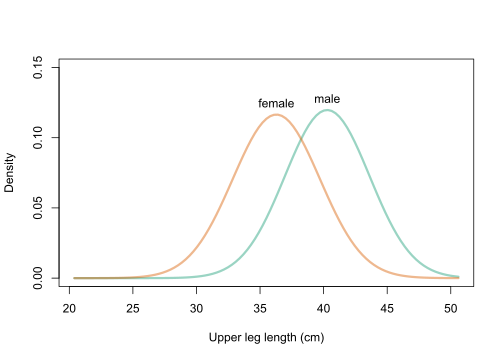

# Instructions

The final exam will be a one-on-one oral exam with the instructor.  Please meet the instructor near the "fish-bowl" office in the Data Science Institute lobby. The exam will be recorded in Zoom. Please prepare solutions to the following is a set of questions. During the oral exam, the instructor will ask a series of questions covering topics from the course and the questions. For example, the instructor may ask:

1. Please explain how you solved a particular question.
1. Please solve a new question (perhaps closely related to a question below).
1. Please explain course topic X.

You will be graded on both the accuracy of your responses and the clarity with which you explain course concepts and solutions to questions.

The final exam should represent your own work.  Do not consult with or collaborate in any way with anyone other than the instructor.

Prior to meeting with the instructor, you should:

   + Create a folder in your Probability and Inference Portfolio; call it `99-final-exam`.
   + Compile, save, and push your solutions to your GitHub repository

# 1. Simulation

The Monte Hall problem is a classic game show.  Contestants on the show where shown three doors.  Behind one randomly selected door was a sportscar; behind the other doors were goats.

At the start of the game, contestants would select a door, say door A.  Then, the host would open either door B or C to reveal a goat.  At that point in the game, the host would ask the contestant if she would like to change her door selection.  Once a contestant decided to stay or change, the host would open the chosen door to reveal the game prize, either a goat or a car.

In this problem, consider a **modified** version of the Monte Hall problem in which the number of doors is **variable**.  Rather than 3 doors, consider a game with 4 or 5 or 50 doors.  In the modified version of the game, a contestant would select an initial door, say door A.  Then, the host would open **one** of the remaining doors to reveal a goat.  At that point in the game, the host would ask the contestant if she would like to change her door selection.  Once a contestant decided to stay or change, the host would open the chosen door to reveal the game prize, either a goat or a car.

Consider two strategies:
  
  1. Always stay with the first door selected.
  2. Always switch to the unopened door.

**C.** The function `game` below plays a single game of Monte Hall.  The function returns a vector of length two, the first element is the prize under strategy 1 and the second element is the prize under strategy 2.  The function has a single input parameter, N, which is the number of doors in the game.

Use the `game` function to estimate the probability that both strategies result in a goat. Let **N=4**.

```{r}
require(magrittr)
require(dplyr)

game <- function(N){
  if(N<3) stop("Must have at least 3 doors")
  prize <- sample(c(rep("goat",N-1),"car"), N)
  guess <- sample(1:N,1)
  game <- data.frame(door = 1:N, prize = prize, stringsAsFactors = FALSE) %>% 
    mutate(first_guess = case_when(
      door == guess ~ 1
      , TRUE ~ 0
    )) %>% 
    mutate(potential_reveal = case_when(
        first_guess == 1 ~ 0
      , prize == "car" ~ 0
      , TRUE ~ 1
    )) %>% 
    mutate(reveal = 1*(rank(potential_reveal, ties.method = "random") == 3)) %>% 
    mutate(potential_switch = case_when(
      first_guess == 1 ~ 0
      , reveal == 1 ~ 0
      , TRUE ~ 1
    )) %>% 
    mutate(switch = 1*(rank(potential_switch, ties.method = "random") == 3))
  c(game$prize[game$first_guess == 1], game$prize[game$switch == 1])
}
```

Through simulation, I replicated the game several times, and calculated the column mean such that each value of the column was a goat. If the column mean was equal to 1, that means a goat was chosen in both strategies. So from there, I took the mean of all colMeans == 1.

```{r}
a = replicate(10000, game(4))
mean(colMeans(a == c("goat", "goat"))==1)
```
Analytically, you can also think about this problem such that the probability of choosing a goat in both scenarios equals 1 minus the probability of choosing a car in strategy 1 minus choosing a car in strategy 2, since you can't choose a car with both strategies of the same game. There are only 3 outcomes. If you pick the car first (win with strategy 1), then you can't pick a goat with both strategies. Similarly, if you switch and pick the car correctly (win with strategy 2), you can't pick the goat with both strategies. So, the only way to pick a goat both times is if you don't win with either strategy.

```{r}
1 - sum(rowMeans(a == "car"))
```

Probability each strategy results in a car:
Strategy 1: 1/4
Strategy 2: 3/8

Strategy 1: 1/N
Strategy 2: (N-1)/(N*(N-2))

Probability they both result in a goat = 1 - (probability 1 = car) - (probability 2 = car)

```{r}
1 - 1/4 - 3/8
```

Answer: 3/8

**B**. Communicate the precision of your simulated probability in part **C** by calculating a **99\%** confidence interval.

I will run a prop.test on the above simulation. Since I got 0.3750 as a probability, I calculate the confidence interval of 3750/10000, using a 99% confidence level.

```{r}
prop.test(3750,10000, conf.level = 0.99) 
```
The 99% confidence interval is from 0.363 to 0.388.

**A**. Let D(N) be the difference between the difference in probabilities between strategy 2 and strategy 1.

$$
D(N) = P(\text{win strategy 2}|\text{N doors}) - P(\text{win strategy 1}|\text{N doors})
$$
Create a plot that shows how D changes as N increases.  Put N on the x-asis, ranging from 3 to 10.  Put D on the y-axis.

Using the solution from my analytical approach to part C, I can derive D(N) by using the equations for P(W2|N) and P(W1|N)

```{r}
doors = c(3,4,5,6,7,8,9,10)
p = rep(NA,8)
for(i in seq_along(doors)){
  N = i+2
  p1 = 1/N
  p2 = (N-1)/(N*(N-2))
  p[i] = p2 - p1
}

data = array(c(doors, p), dim=c(8,2))

plot(data, ylim = c(0,0.4))
```


# 2. Probability

Consider a test for a rare genetic condition.  Let T+ denote a test result that indicates the condition is present, while T- denotes absence.  Let D+ and D- denote the true status of the disease.

**C**.  Fill-in the probability table using the following information:

+ P(T+|D+) = .85,  and 
+ P(T-|D-) = .95,  and 
+ P(D+) = 0.001

|     | D+    | D-    |      |
|:---:|:---:  |:---:  |:---: |
| T+  |0.00085|0.04995|0.0508|
| T-  |0.00015|0.94905|0.9492|
|     | 0.001 | 0.999 | 1    |

```{r}
a <- 0.001*.85 #D+T+ = D+ * T+|D+
b <- 0.999*0.05 #D-T+ = (1-D+) * (1-T-|D-)
c <- 0.001*0.15 #D+T- = D+ * (1-T+|D+)
d <- 0.999*0.95 #D-T- = (1-D+) * T-|D-
e <- a + b #T+ = D+T+ + D-T+
f <- c + d #T- = D+T- + D-T-
```


**B**. Calculate the **negative** predictive value of the test, P(D-|T-).

Bayes Rule:
P(D-|T-) = P(D-)*P(T-|D-)/P(T-)

(1-P(D+))*P(T-|D-) / ((1-P(D+))*P(T-|D-) + P(D+)*(1-P(T+|D+)))

```{r}
0.999*0.95 / (0.999*0.95 + 0.001*0.15)
```
0.999842


**A** Create a plot that shows how the **positive** predictive value as a function of the prevalence of disease, P(D+).

Bayes Rule:
P(D+|T+) = P(D+)*P(T+|D+)/P(T+)
P(D+|T+) = X*0.85/(X*0.85+(1-X)*0.05)

```{r, eval = FALSE}
prevalence <- seq(0.001, 0.1, length = 50)
ppv <- 0.85*prevalence/(0.85*prevalence+(1-prevalence)*0.05)
plot(prevalence, ppv, xlab = "Prevalence", ylab = "PPV")
```

# 3. Discrete Distributions

Suppose the yearly hospital charges (in thousands of dollars) for a randomly selected Vanderbilt student is a mixture distribution.

For 50% of students, the hospital charges will be $0.  For the remaining 50% of students, the hospital charges are a random variable described by a gamma distribution with shape = 2 and scale = 2.  (Again, in thousands of dollars.)   

```{r}
hospital_charges <- function(N){
  group <- rbinom(N, 1, 0.5)
  charges <- 0*group + rgamma(N, shape = 2, scale = 2)*(1-group)
  charges
}
```

**C**.  What is the 90th percentile for yearly hospital charges for a randomly selected Vanderbilt student?

```{r}
hospital_charges(1000000) %>% quantile(0.9)
```
6,000 dollars. I found this by using the quantile function on the `hospital_charges` function.


**B**.  Consider the **class** average yearly hospital charge for the students in a class of size 30.  Plot the density function or a simulated histogram of the class average yearly hospital charge.

Through simulation, I calculated the average yearly hospital charge many times and stored these averages in an array, which I then graphed as a histogram.

```{r}
a <- rep(NA,5000)
for(i in 1:5000){
  a[i] <- mean(hospital_charges(30))
}
hist(a, breaks=30)
```

The class average for a 30 student class is right around $2,000.


**A**.  What is the probability that a randomly selected class of size 30 students will have less than 10 students with zero yearly hospital charges?

Through simulation, you can use the `hospital_charges` function to get the yearly hospital charges for a class of size 30. Then, you can count how many of those charges are equal to 0, and check if that sum is less than 10. If it is, then that class has less than 10 kids with zero hospital charges. You can replicate this many times and take the mean to get a probability.

```{r}
mean(replicate(100000,sum(hospital_charges(30)==0)<10))
```

0.02195

Analytically, you can also solve this problem without using the distribution for hospital charges. The probability that you have 0 hospital charges is just equal to 0.5. So, you can use pbinom to find 10 or less in 30 trials.
```{r}
pbinom(9,30,0.5)
```

0.021387


# 4. Continuous Distributions

**C.** Suppose diastolic blood pressure (DBP) follows a normal distribution with mean 80 mmHg and SD 15 mmHg. What is the probability that a randomly sampled person’s DBP lies between 70 and 104 mmHg?

You can solve this by taking the cumulative probability that the DBP is less than 104 and subtracting the cumulative probability the DBP is less than 70

```{r}
pnorm(104, 80, 15) - pnorm(70, 80, 15)
```
Answer: 0.6927

**B.** Suppose a human femur was discovered that is 37 cm long.  Also suppose that using the NHANES data, researchers believe the distribution of femur bones, by sex, are distributed as follows:

+ Female adult femur $\sim N(36, 3.3)$
+ Male adult femur $\sim N(40, 3.4)$



Under the assumption that male and females are equally likely, what is the probability that the discovered femur was from a male?

We want to find the probability the femur is male, given that it was 37cm long. Using Bayes rule, this is equal to:
(P(Male)*P(37in|male))/P(37in).

P(Male) = 0.5
P(37in|male) = dnorm(37,40,3.4)
P(37in) = 0.5*dnorm(37,40,3.4)+0.5*dnorm(37,36,3.3) 

```{r}
pm <- 0.5
m_37 <- dnorm(37,40,3.4)
mn_37 <- 0.5*dnorm(37,40,3.4)+0.5*dnorm(37,36,3.3)

(pm*m_37)/mn_37
```

There is a 0.4078 probability the femur is from a male.


**A.**  Continuing part **B**, generate a plot of P(femur from male | femur length = x).  Let femur length range from 25 to 50. 


Using the same calculations as above, we can calculate P(femur length|male) and P(femur length) using dnorm, and do this for femur lengths from 25 to 50. Then we can use Bayes rul to determine the probability that the femur belongs to a male.

```{r}
femur_length <- 25:50

pm <- 0.5
m_fl <- dnorm(femur_length,40,3.4)
fl <- 0.5*dnorm(femur_length,40,3.4)+0.5*dnorm(femur_length,36,3.3)

prob_male <- (pm*m_fl)/fl

plot.new()
plot.window(xlim = c(25,50), ylim = c(0,1))
lines(femur_length, prob_male)
axis(1)
axis(2)
box()
title(xlab = "Femur Length", ylab = "P(Male | femur length)")
```

# 5. Expectation and Variance

Let us revisit the yearly hospital charges distribution from a previous section.

>**Recall:** The yearly hospital charges (in thousands of dollars) for a randomly selected Vanderbilt student is a mixture distribution. For 50% of students, the hospital charges will be $0.  For the remaining 50% of students, the hospital charges are a random variable described by a gamma distribution with shape = 2 and scale = 2.  (Again, in thousands of dollars.)   

```{r}
hospital_charges <- function(N){
  group <- rbinom(N, 1, 0.5)
  charges <- 0*group + rgamma(N, shape = 2, scale = 2)*(1-group)
  charges
}
```

**C.** What is E[yearly hospital charges]?

Through simulation, you can calculate the expected value by taking the mean of a large sample of `hospital_charges`.

```{r}
mean(hospital_charges(1000000))
```

Analytically, knowing that this is a mixture distribution, we have that E[X + Y] = E[X] + E[Y], where X is the 50% of students that have zero hospital charges, and Y is the gamma distribution with shape = 2 and scale = 2.

So we have E[hospital_charges] = 0.5*0 + 0.5*shape*scale

```{r}
0*0.5 + 0.5*2*2
```

The expected value is 2,000 dollars.


**B.** Suppose Vanderbilt implements a cap of \$10,000 on yearly student hospital charges.  What is the mean yearly hospital charge under the new policy?

To solve this, I can use the `hospital_charges` function to gather many student hospital charges, then I can replace all charges that are greater than 10 with a value of 10 exactly, to meet the cap. Then I can take the mean of the newly filtered data.

```{r}
hc_df <- hospital_charges(1000000) %>% data.frame(charge=.)
hc_df$charge[hc_df$charge > 10] <- 10
mean(hc_df$charge)
```

Answer: 1,950 dollars


**A.** What is the variance of yearly hospital charge under the new policy?

I can use the same strategy as before, only this time calculate the variance of the newly filtered data set.

```{r}
hc_df <- hospital_charges(1000000) %>% data.frame(charge=.)
hc_df$charge[hc_df$charge > 10] <- 10
var(hc_df$charge)
```

Answer: 7,030 dollars.


# 6. Transformations & Sampling Distributions

**C.** Consider the log normal distribution.  If X is a log normal random variable, then log(X) is a normal random variable.  One way to create pseudo-random draws from the log normal distribution is to generate draws from a normal distribution and then to transform the draws by exponentiating.  The parameters of the log normal distribution are the parameters of the underlying normal distribution, $\mu$ and $\sigma$ (or $\sigma^2$).  

Log normal data are prevalent is biological systems and econometrics.

Suppose a blood chemistry measure has a log normal distribution with $\mu$ = 0 and $\sigma$ = 1. Generate an histogram or density curve for the sampling distribution of the median when the sample size is 101.

First, I will use simulation to calculate the mean for many sets of sample data, and create histogram. Then, I will use analytical methods and order statistics to derive a density curve.

```{r}
N <- 5000
med <- rep(NA,N)
for(i in 1:N){
  med[i] <- rlnorm(101,0,1) %>% median
}

hist(med, freq=FALSE)

fk <- function(x,k,n){
  k*
  choose(n,k)*
  (plnorm(x, 0, 1))^(k-1)*
  (1-plnorm(x, 0, 1))^(n-k)*
  dlnorm(x, 0, 1)
}

curve(fk(x, 51, 101), 0,2, add = TRUE, col="blue", lw=3)
```
 

**B.** Below is the CDF function for the kth order statistic when the underlying distribution is log normal with $\mu$ = 0 and $\sigma$ = 1.  Create a plot of the ECDF of the simulated sampling distribution generated in **C** and overlay the CDF using the function below.

```{r}
Fk <- function(x,k,n){
  pbinom(k-1, n, plnorm(x), lower.tail = FALSE)
}
```

```{r}
N <- 5000
med <- rep(NA,N)
for(i in 1:N){
  med[i] <- rlnorm(101,0,1) %>% median
}

plot(ecdf(med))

curve(Fk(x, 51, 101), 0.6,1.6, add = TRUE, col="red", lw=1)
```


**A.** Of the 25th, 50th, and 75th quantiles of the distribution from **B**, which will have the tightest 95% CI?  (Show the sampling distribution of each.)

```{r}
N <- 5000
q25 <- rep(NA,N)
q50 <- rep(NA,N)
q75 <- rep(NA,N)
for(i in 1:N){
  data <- rlnorm(101,0,1)
  q25[i] <- data %>% quantile(.25)
  q50[i] <- data %>% quantile(0.5)
  q75[i] <- data %>% quantile(0.75)
}

hist(q25) 
hist(q50)
hist(q75)

q25 %>% quantile(c(0.025,0.975)) %>% diff
q50 %>% quantile(c(0.025,0.975)) %>% diff
q75 %>% quantile(c(0.025,0.975)) %>% diff
```
The 25th quantile has the narrowest 95% confidence interval. This is because the cumulative prodbability is less at the 25th quantile than it is at the 50th or 75th quantile, so there is a smaller probability to estimate from and therefore a smaller chance for error.


# 7. Estimation of CDF and PDF from data

The following code will load the NHANES data and select the first 500 rows.

```{r}
Hmisc::getHdata(nhgh)
d1 <- nhgh[1:500,]
heights <- d1 %>% filter(age>18 & sex=="male") %>% pull(ht)
```

**C.** Estimate the distribution of standing height for adult (age > 18) males using the MLE method with a normal distribution.  Create a plot of the estimated density function.

Since we are dealing with a normal distribution, the parameters can be estimated using the `lm` function. 
```{r}
mle <- lm(heights ~ 1) %>% summary
m_lm <- mle$coefficients[1]
sd_lm <- mle$sigma[1]

hist(heights, freq=FALSE, ylim = c(0,0.06))
curve(dnorm(x, m_lm, sd_lm), lwd=3, col="blue", add=TRUE)
```

I will also show the traditional MLE method, which yields very similar results

```{r}
require(stats4)
nLL <- function(mean, sd){
  fs <- dnorm(
        x = heights
      , mean = mean
      , sd = sd
      , log = TRUE
    ) 
  -sum(fs)
}

fit <- mle(
    nLL
  , start = list(mean = 1, sd = 1)
  , method = "L-BFGS-B"
  , lower = c(0, 0.01)
)

mean1 <- coef(fit)[1]
sd1 <- coef(fit)[2]

hist(heights, freq=FALSE, ylim = c(0,0.06))
curve(dnorm(x, mean1, sd1), lwd=3, col="blue",  add=TRUE)
```


**B.** Estimate the distribution of BMI for adult (age > 18) females using using the method of moment method with the gamma distribution. Create a plot of the estimated density function.

Now, I will use method of moments to show how to estimate parameters of the gamma distribution. I know that for the gamma distribution, mean = shape * scale, and variance = shape * $scale^2$. Therefore, we can calculate that scale = variance / mean, and shape = mean$^2$ / variance.

```{r}
bmi <- d1 %>% filter(age>18 & sex=="female") %>% pull(bmi)

mean_bmi <- mean(bmi)
var_bmi <- var(bmi)
shape_bmi <- mean_bmi^2/var_bmi
scale_bmi <- var_bmi/mean_bmi

hist(bmi, freq=FALSE, xlim = c(10, 80))
curve(dgamma(x, shape=shape_bmi, scale=scale_bmi), lwd=3, col="blue", add=TRUE)
```


**A.** Estimate the distribution of creatinine (SCr) for adults (age > 18) using the kernel density method with a Gaussian kernel.  Create a plot of the estimated density function.

Finally, I will use the kernel density method and create the `epdfstar` function to estimate the distribution.

```{r}
scr <- d1 %>% filter(age>18 & !is.na(SCr)) %>% pull(SCr)

epdfstar <- function(t, data, smooth){
  outer(t, data, function(a,b){ dnorm(a, b, smooth)}) %>% rowMeans
}

hist(scr, freq = FALSE, main = "", breaks=100 ,xlim = c(0,2.5))
curve(epdfstar(x, scr, smooth = 0.1), lwd=3, col="blue", add=TRUE)

```


# 8. Sample from an estimated distribution

The following code will load the low birth weight data from the MASS package.  The description of the variables in the dataset can be found in the birthwt documentation with the command `?MASS::birthwt`.

```{r}
bwt <- MASS::birthwt

sbwt <- bwt %>% 
  filter(smoke == 1) %>% 
  pull(bwt)
```

**C.** Generate a 95% confidence interval for the mean birthweight of infants whose mothers **did** smoke during pregnancy using the bootstrap.

```{r}
n <- length(sbwt)
M <- 5000
out <- rep(NA, M)
for(i in 1:M){
  index <- sample.int(n, n, replace = TRUE)
  out[i] <- sbwt[index] %>% mean
}

quantile(out, c(0.025, 0.975))
```
Using bootstrap, the 95% confidence interval is 2621 to 2920.

**B.** Generate a 95% confidence interval for the mean birthweight of infants whose mothers **did** smoke during pregnancy using the Central Limit Theorem shortcut.

```{r}
t.test(sbwt)
```
Using the CLT shortcut, the 95% confidence interval is 2619 to 2925

**A.** Let $\mu_s$ be the mean birthweight of infants whose mothers smoked during pregnancy.  Let $\mu_{ns}$ be the mean for the non-smoking group.  Use simulation to calculate the 95% confidence interval for $\mu_s/\mu_{ns}$.

```{r}
nsbwt <- bwt %>% 
  filter(smoke == 0) %>% 
  pull(bwt)

sbwt <- bwt %>% 
  filter(smoke == 1) %>% 
  pull(bwt)

data <- rep(NA, 5000)

ms <- mean(sbwt)
sds <- sd(sbwt)
mns <- mean(nsbwt)
sdns <- sd(nsbwt)

for(i in 1:5000){
  data[i] <- mean(rnorm(1000, ms, sds))/mean(rnorm(1000, mns, sdns))
}

quantile(data, c(0.025, 0.975))
```

Using simulation, the 95% confidence interval for $\mu_s/\mu_{ns}$ is 0.888 to 0.927.
 
 
# 9.  Inference

**C.** Suppose two studies were performed looking at the risk of mild complication after hernia repair using open and laparoscopic surgical approaches.  The study results are below.  Using the data from each study individually, perform the hypothesis test that the risk of complication between open and laparoscopic repairs are the same under the usual point null. What is the p-value from each study?  What do you conclude from each study?


| Study 1 | Comp | No comp |
|:---|:---|:---|
| Open | 30 | 70 |
| Lap  | 35 | 65 |

| Study 2 | Comp | No comp |
|:---|:---|:---|
| Open | 600 |     1400 |
| Lap  | 619 |     1381 |

The null hypothesis here is that the proportion of complications during open repairs equals the proportion of complications during laparoscopic repairs.

```{r}
prop.test(c(30,35), c(100,100))
p1_null = 30/100
prop.test(35,100)
p1_null
```
Study 1: the p-value is 0.5459, which is not <0.05, so there is no significant difference between the complication proportions of each procedure. Also, the CI for the laparoscopic data is from 0.2591 to 0.4526, which contains the proportion for open surgery (0.3), so again, there is no significant difference.

```{r}
prop.test(c(600,619), c(2000,2000))
p2_null = 600/2000
prop.test(619,2000)
p2_null
```
Study 1: the p-value is 0.5364, which is not <0.05, so there is no significant difference between the complication proportions of each procedure. Also, the CI for the laparoscopic data is from 0.2893 to 0.3303, which contains the proportion for open surgery (0.3), so again, there is no significant difference.


**B.** Suppose that prior to the studies, the researchers established an equivalence threshold of 6 percentage points.  Using the confidence intervals, which studies (if any) showed a conclusive similarity between surgical approaches for the complication rate.  Explain why.

In order for there to be a conclusive similarity between surgeries, the confidence interval needs to fall between -0.06 and 0.06. The CI for strategy 1 is -0.1896 to 0.0896, so this goes beyond the equivalence threshold on both sides, and therefore does not show a conclusive similarity. The CI for strategy 2 is  -0.0385 to 0.0195, which does fall completely between -0.06 and 0.06, meaning that study 2 does show a conclusive similarity between the procedures.

**A.** If the data from the studies were combined, what is the smallest equivalence threshold that would identify a conclusive similarity between the surgical approaches?

```{r}
prop.test(c(630,654), c(2100,2100))
```
The smallest equivalence threshold would have to be 3.977 percentage points in order to fully contain the confidence interval and identify a conclusive similarity.

# 10.  Joint Distributions

**C.** Fill in the blank.  The sample correlation is a measure of _____linear_______ association.

**B.** Explain why predictions from a conditional distribution generally have smaller prediction error than predictions from the marginal distribution.

Marginal distributions are sums of conditional distributions, so they are bigger numbers and are spread out wider, which creates a bigger range of potential estimates, thus increasing the prediction error. Conditional distributions are looking at subsets of the population for which we have more information on, and are therefore smaller numbers and narrower distributions.

**A.** Use the CLT shortcut to calculate the 95% confidence interval for the correlation of arm circumference and arm length using the NHANES dataset.  Is the sample correlation a reasonable measure of association for this data?

```{r}
Hmisc::getHdata(nhgh)
sn <- nhgh[1:1000,]
plot(sn$armc, sn$arml, ylab = "arm len", xlab = "arm Circumf")

cor(sn$armc, sn$arml, use="complete.obs")

cor.test(sn$armc, sn$arml)
```
The 95% CI is from 0.434 to 0.531. The sample correlation is a reasonable measure of association for this data because the two variables have a positive linear relationship.